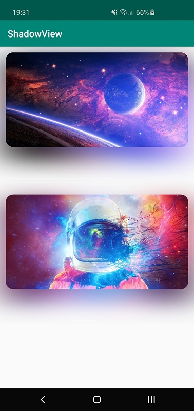

# ShadowView
Dynamic shadows on Android

I didn't publish it as a library for couple of reasons, but there's a separate module with the ShadowView and an example project.

Currently it has some bugs/limitations and maybe not the best API.

So gotcha #1: parent view has to set `android:clipChildren="false"` so the shadow is not clipped. It can be done without it, but I was too lazy back in time.

Gotcha #2: if you want to cast a shadow for an ImageView (like in the example), you gotta be aware that ImageView has a quirky way of drawing itself on canvas if you set a scale type. So for instance, if you set scale type `centerCrop`, the shadow would be much bigger than the ImageView itself, like the bitmap was scaled.

I haven't worked it around yet and would appreciate a contribution.

Gotcha #3: in some cases shadow might be cut, I'm assuming it might be related to ImageView's scale type again.

Regarding the performance, it works super fast, as I'm blurring a very downscaled version of the View's snapshot.
